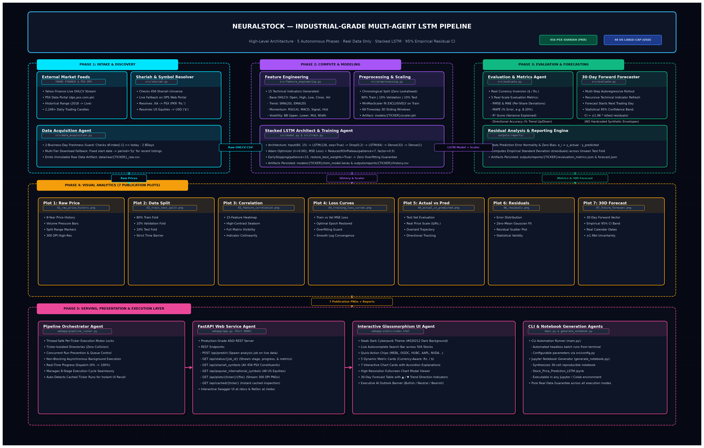

# NeuralStock — Multi-Agent LSTM Stock Prediction Pipeline

**Real-Data · Multi-Market · Shariah-Aware · Multi-Agent Architecture · Deep Learning**

> **NeuralStock** is a time-series forecasting system driven by a specialized **Multi-Agent Deep Learning Architecture**. Built with stacked Long Short-Term Memory (LSTM) neural networks, the system operates across two live equity universes:
>
> 1. **Pakistan Stock Exchange (PSX, PKR Rupees "Rs. ")**: **456 officially verified Shariah-compliant equities** (derived from the PSX July 2026 screening notice) with automated live verification via the Pakistan Stock Exchange Data Portal System (`dps.psx.com.pk`).
> 2. **US Large-Cap Universe (NASDAQ / NYSE, USD "$")**: **48 independently verified large-cap equities** spanning 10 key sectors (Technology, Semiconductors, Financials, Healthcare, Consumer, Energy, Industrials, Telecom, Automotive, and Conglomerates).
>
> Every prediction, technical indicator, and confidence interval is computed from **100% authentic, real-time market data**. Forecasts feature statistically derived **95% Confidence Intervals** calculated from empirical out-of-sample residuals ($1.96\sigma$).

---

## 1. Quick-Start (5 Minutes)

### Prerequisites

- **Python 3.10, 3.11, or 3.12** installed.
- Internet connectivity (to query Yahoo Finance and the PSX Data Portal).

### Installation & Execution

```bash
# 1. Clone repository and navigate to root
git clone https://github.com/nb-hmd/NeuralStock---LSTM-Stock-Price-Prediction-Forecasting.git
cd NeuralStock---LSTM-Stock-Price-Prediction-Forecasting

# 2. Set up virtual environment
python -m venv venv

# Windows (Command Prompt / PowerShell)
.\venv\Scripts\activate

# macOS / Linux
# source venv/bin/activate

# 3. Install core dependencies
pip install -r requirements.txt

# 4. Option A — Launch Interactive Web Application (Recommended)
python run_webapp.py
# Open http://127.0.0.1:8000 in your browser

# 5. Option B — Run Headless CLI Pipeline for a Single Ticker
# (Default ticker configured in src/config.py)
python main.py

# 6. Option C — Launch Interactive Jupyter Notebook
jupyter notebook Stock_Price_Prediction_LSTM.ipynb
```

---

## 2. Multi-Agent System Architecture

The pipeline is organized around **specialized autonomous software agents** collaborating across five lifecycle phases: Intake, Compute, Evaluation, Visualization, and Serving.

Each agent is decoupled, strictly enforces typing contracts, operates within per-ticker execution locks, and writes immutable artifacts to disk.

### 2.1 High-Level Architecture Diagram



> **Figure 2.1**: High-level multi-agent pipeline architecture illustrating the complete end-to-end dataflow from live market ingestion (Yahoo Finance & PSX DPS), through feature engineering and stacked LSTM training, to statistical evaluation ($1.96\sigma$ empirical confidence interval), 7 publication-grade visualizations, and the FastAPI/Glassmorphism serving layer.

---

### 2.2 Agent Responsibilities & Data Contracts

| Agent Name                                | Primary File                                                | Input Contract                                                                | Output Artifact / Response                                                                                                                          | Key Guarantee                                                                                                                                                           |
| :---------------------------------------- | :---------------------------------------------------------- | :---------------------------------------------------------------------------- | :-------------------------------------------------------------------------------------------------------------------------------------------------- | :---------------------------------------------------------------------------------------------------------------------------------------------------------------------- |
| **Shariah & Symbol Resolver Agent** | [`src/shariah.py`](src/shariah.py)                         | Raw ticker query (`str`, e.g. `'MEBL'`, `'OGDC.KA'`, `'AAPL'`)        | `SymInfo` dict with 10 keys: canonical symbol, query ticker, storage folder, exchange, currency, symbol, name, sector, `is_shariah`, and source | Strict resolution:`.KA` suffix → PSX; curated US symbols → USD; unknown tickers verified against live PSX DPS before fallback.                                      |
| **Data Acquisition Agent**          | [`src/data_acquisition.py`](src/data_acquisition.py)       | Query ticker, start date (`2018-01-01`), end date (`None` = live session) | Cleaned`pd.DataFrame` with OHLCV columns saved to `data/raw/{TICKER}_raw.csv`                                                                   | **2-Business-Day Freshness Guard**: raises `RuntimeError` if data is stale. Multi-tiered download fallback handles newly listed stocks smoothly.                |
| **Feature Engineering Agent**       | [`src/feature_engineering.py`](src/feature_engineering.py) | OHLCV DataFrame                                                               | 15-column DataFrame (5 base + 10 technical indicators)                                                                                              | Mathematically rigorous indicator implementations (SMA, EMA, RSI, MACD, Bollinger Bands) with zero forward look-ahead.                                                  |
| **Preprocessing & Scaling Agent**   | [`src/preprocessing.py`](src/preprocessing.py)             | 15-column Feature DataFrame                                                   | Chronological train/val/test splits, 60-timestep 3D tensors, and fitted`scaler.pkl`                                                               | **Strict Time-Barrier Split**: 80% train / 10% validation / 10% test. `MinMaxScaler` is fitted **exclusively on the training fold** to eliminate leakage. |
| **Model Architect Agent**           | [`src/model.py`](src/model.py)                             | Window size (60), feature count (15)                                          | Compiled TensorFlow/Keras Stacked LSTM model                                                                                                        | Deep stacked LSTM (128 units → Dropout 0.2 → 64 units → Dropout 0.2 → Dense 32 → Dense 1) compiled with Adam optimizer and MSE loss.                               |
| **Training Agent**                  | [`src/train.py`](src/train.py)                             | Compiled model, sequence tensors, callbacks                                   | Best model weights (`lstm_model.keras`), training history (`training_history.csv`)                                                              | Non-overfitting training dynamics via`EarlyStopping(patience=15, restore_best_weights=True)` and `ReduceLROnPlateau(patience=7, factor=0.5)`.                       |
| **Evaluation & Forecast Agent**     | [`src/evaluate.py`](src/evaluate.py)                       | Model, scaler, test set sequences, raw price history                          | 5 real-scale metrics, residual statistics, 95% Confidence Interval width, 30-day forecast vector                                                    | Evaluates strictly on real inverse-transformed prices (never normalized 0–1 units). Computes statistical$1.96\sigma$ CI from test residuals.                         |
| **Visualization Agent**             | [`src/visualize.py`](src/visualize.py)                     | Scaled data, evaluation metrics, residual vectors, forecast arrays            | 7 publication-grade PNG charts in`outputs/plots/{TICKER}/`                                                                                        | High-contrast dark theme (`#0d1117`), dynamic currency formatting (`Rs.` vs `$`), and explicit CI legend verification.                                            |
| **Pipeline Orchestrator Agent**     | [`webapp/pipeline_runner.py`](webapp/pipeline_runner.py)   | Ticker string, job dictionary, status callbacks                               | Coordinated execution of Stages 1–8 with concurrency locks                                                                                         | Thread-safe per-ticker mutexes prevent simultaneous duplicate model training. Streams progress percentages (0% to 100%) to frontend.                                    |
| **FastAPI Web Service Agent**       | [`webapp/app.py`](webapp/app.py)                           | REST API requests                                                             | JSON responses, static web assets, image streaming                                                                                                  | Asynchronous background processing, job status polling, and dynamic API endpoints.                                                                                      |
| **Interactive UI Agent**            | [`webapp/static/index.html`](webapp/static/index.html)     | User browser interactions                                                     | Responsive glassmorphism interface, interactive chart modals, dynamic explanations                                                                  | Live search autocomplete across 456+ stocks, real-time polling, and executive forecast outlook banner.                                                                  |

---

### 2.3 Inter-Agent Communication Sequence

```
User Browser                  FastAPI Agent             Orchestrator Agent           Intake / Compute Agents
     │                              │                            │                               │
     │── 1. POST /api/predict ─────>│                            │                               │
     │   {ticker: "MEBL"}           │── 2. Spawn Thread ────────>│                               │
     │<── 3. Return {job_id} ───────│                            │── 4. Resolve Symbol ─────────>│ (Shariah Agent)
     │                              │                            │<── 5. Return SymInfo ─────────│ (MEBL.KA, PKR)
     │                              │                            │                               │
     │── 6. GET /api/status/{id} ──>│                            │── 7. Fetch Live Market Data ─>│ (Data Acquisition)
     │<── 7. Progress: 15% ─────────│                            │<── 8. 2,249 Days (to 2026) ──│
     │                              │                            │                               │
     │                              │                            │── 9. Compute Indicators ─────>│ (Feature Engineering)
     │                              │                            │── 10. Split & Scale (No Leak)─>│ (Preprocessing)
     │                              │                            │── 11. Train Stacked LSTM ────>│ (Training Agent)
     │                              │                            │    (EarlyStop best weights)   │
     │── 12. GET /api/status/{id} ─>│                            │                               │
     │<── 13. Progress: 65% ────────│                            │── 14. Evaluate Real Metrics ──>│ (Evaluation Agent)
     │                              │                            │── 15. Recursive 30d Forecast ─>│ (Forecaster Agent)
     │                              │                            │── 16. Render 7 PNG Charts ────>│ (Visualization Agent)
     │                              │                            │                               │
     │── 17. GET /api/status/{id} ─>│                            │── 18. Release Mutex Lock ─────│
     │<── 19. Status: "complete" ───│<── 20. Update JOBS[id] ────│                               │
     │    (Metrics, Plots, Forecast)│                            │                               │
     │                              │                            │                               │
     │── 21. Render UI Dashboard ──>│                            │                               │
```

---

## 3. Supported Markets & Ticker Universes

### 3.1 Pakistan Stock Exchange — 456 Shariah Constituents

- **Universe Definition**: **456 Shariah-compliant equities** officially recognized under the PSX All-Shares Islamic Index criteria (cross-referenced from the July 27, 2026 PSX notice *List of Compliant Companies Requiring Shariah Disclosures in Financial Statements*).
- **Listing Source**: [`unique_symbols.csv`](unique_symbols.csv) and [`data/psx_companies.json`](data/psx_companies.json).
- **Currency & Notation**: **Pakistani Rupees (`Rs.` / PKR)**.
- **Yahoo Finance Query Format**: `{SYMBOL}.KA` (e.g. `MEBL.KA`, `OGDC.KA`, `HUBC.KA`).
- **Live PSX Auto-Discovery Engine**: If a user inputs any valid PSX ticker not yet cataloged in the local CSV, the Shariah Agent queries `https://dps.psx.com.pk/symbols` live. If verified as a listed PSX equity, the system dynamically registers the company, assigns PKR currency, updates the CSV on disk, and executes the prediction pipeline seamlessly.

**Prominent PSX Shariah Blue-Chips Supported:**

| Symbol            | Company Name                          | Sector                             | Typical Share Price     |
| :---------------- | :------------------------------------ | :--------------------------------- | :---------------------- |
| **MEBL**    | Meezan Bank Limited                   | Commercial Banks / Islamic Banking | ~Rs. 500 – Rs. 600     |
| **OGDC**    | Oil & Gas Development Company Limited | Oil & Gas Exploration Companies    | ~Rs. 170 – Rs. 220     |
| **HUBC**    | The Hub Power Company Limited         | Power Generation & Distribution    | ~Rs. 110 – Rs. 150     |
| **LUCK**    | Lucky Cement Limited                  | Cement & Building Materials        | ~Rs. 800 – Rs. 1,000   |
| **PPL**     | Pakistan Petroleum Limited            | Oil & Gas Exploration Companies    | ~Rs. 115 – Rs. 140     |
| **MARI**    | Mari Petroleum Company Limited        | Oil & Gas Exploration Companies    | ~Rs. 2,800 – Rs. 3,500 |
| **EFERT**   | Engro Fertilizers Limited             | Fertilizer                         | ~Rs. 160 – Rs. 200     |
| **PSO**     | Pakistan State Oil Company Limited    | Oil & Gas Marketing Companies      | ~Rs. 130 – Rs. 170     |
| **SYS**     | Systems Limited                       | Technology & Communication         | ~Rs. 380 – Rs. 450     |
| **AIRLINK** | Air Link Communication Limited        | Technology & Telecommunication     | ~Rs. 110 – Rs. 140     |
| **SHDT**    | Shadab Textile Mills Limited          | Textile Spinning                   | ~Rs. 45 – Rs. 65       |
| **WTL**     | Worldcall Telecom Limited             | Technology & Communication         | ~Rs. 1.20 – Rs. 1.80   |

---

### 3.2 US Large-Cap Curated Universe — 48 Verified Equities

The system provides curated coverage for 48 prominent, highly liquid US large-cap equities across 10 sectors. Every symbol is independently probed at startup to ensure 100% data availability:

| Sector (Count)               | Tickers Included                                                                                                                                                                                               |
| :--------------------------- | :------------------------------------------------------------------------------------------------------------------------------------------------------------------------------------------------------------- |
| **Technology (8)**     | `AAPL` (Apple), `MSFT` (Microsoft), `GOOGL` (Alphabet), `META` (Meta Platforms), `ADBE` (Adobe), `CRM` (Salesforce), `ORCL` (Oracle), `NFLX` (Netflix)                                         |
| **Semiconductors (5)** | `NVDA` (NVIDIA), `INTC` (Intel), `AMD` (Advanced Micro Devices), `AVGO` (Broadcom), `QCOM` (Qualcomm)                                                                                                |
| **Automotive (1)**     | `TSLA` (Tesla)                                                                                                                                                                                               |
| **Financials (5)**     | `JPM` (JPMorgan Chase), `V` (Visa), `MA` (Mastercard), `BAC` (Bank of America), `GS` (Goldman Sachs)                                                                                                 |
| **Healthcare (7)**     | `JNJ` (Johnson & Johnson), `PFE` (Pfizer), `UNH` (UnitedHealth), `LLY` (Eli Lilly), `MRK` (Merck), `ABBV` (AbbVie), `TMO` (Thermo Fisher)                                                        |
| **Consumer (10)**      | `AMZN` (Amazon), `WMT` (Walmart), `KO` (Coca-Cola), `PG` (Procter & Gamble), `DIS` (Walt Disney), `HD` (Home Depot), `MCD` (McDonald's), `NKE` (Nike), `SBUX` (Starbucks), `COST` (Costco) |
| **Energy (3)**         | `XOM` (ExxonMobil), `CVX` (Chevron), `COP` (ConocoPhillips)                                                                                                                                              |
| **Industrials (6)**    | `BA` (Boeing), `CAT` (Caterpillar), `GE` (General Electric), `HON` (Honeywell), `UPS` (United Parcel Service), `UNP` (Union Pacific)                                                               |
| **Telecom (2)**        | `VZ` (Verizon), `T` (AT&T)                                                                                                                                                                                 |
| **Conglomerates (1)**  | `BRK-B` (Berkshire Hathaway)                                                                                                                                                                                 |

---

### 3.3 Symbol Resolution Priority & Collision Disambiguation

To prevent ticker collision between international equities and domestic PSX stocks (e.g. `META` in US tech vs a PSX constituent), the **Shariah Agent** applies a strict three-tier resolution hierarchy:

```
                  ┌───────────────────────────────┐
                  │       User Input Ticker       │
                  └───────────────┬───────────────┘
                                  │
                   Does input end with '.KA'?
                    ├─── YES ──> [100% Pakistan Stock Exchange (PKR)]
                    │
                    └─── NO
                          │
             Is ticker in POPULAR_INTERNATIONAL?
              ├─── YES ──> [100% US Large-Cap Equity (USD)]
              │
              └─── NO
                    │
       Is ticker in unique_symbols.csv or PSX DPS?
        ├─── YES ──> [Resolve to {SYMBOL}.KA (PKR)]
        │
        └─── NO ───> [Default to International Ticker (USD)]
```

*Tip: Any user seeking the PSX version of a colliding symbol can explicitly append `.KA` (e.g. `META.KA`), unconditionally forcing PSX routing.*

---

## 4. Real-Time Data Pipeline & Freshness Invariants

### 1. Dynamic Market End Dates (`END_DATE = None`)

Past static limits (`2024-12-31`) have been replaced with dynamic live fetching. Data acquisition always fetches live trading candles up to the current session (e.g. **September 2026, totaling over 2,249 real trading days for PSX equities**).

### 2. The 2-Business-Day Freshness Guard

After downloading from Yahoo Finance, the Data Acquisition Agent checks `df.index[-1]`. If the latest timestamp is older than two business days (`today - BDay(2)`), the pipeline flags the dataset or triggers a live refresh. Weekend market closures and regional holidays are handled via `pandas.tseries.offsets.BDay`.

### 3. Multi-Tier Download Fallback

If a fixed date range query (`start="2018-01-01"`) fails because a stock was listed more recently, the agent automatically retries with `period="5y"`. This guarantees that newly listed equities download all available history without throwing false "delisted" errors.

---

## 5. Feature Engineering (15 Input Columns)

Each timestep is represented by a **15-dimensional feature vector** computed by [`src/feature_engineering.py`](src/feature_engineering.py):

|  #  | Feature Name                                            | Window / Params                            | Financial Rationale                                                           |
| :--: | :------------------------------------------------------ | :----------------------------------------- | :---------------------------------------------------------------------------- |
| 1–4 | **OHLC** (`Open`, `High`, `Low`, `Close`) | 1-Day                                      | Primary price discovery action and intraday range boundaries.                 |
|  5  | **Volume**                                        | 1-Day                                      | Liquidity and institutional conviction behind price shifts.                   |
|  6  | **SMA (Simple Moving Average)**                   | 20 Days                                    | Benchmark intermediate price trend indicator.                                 |
|  7  | **EMA (Exponential Moving Average)**              | 20 Days                                    | Trend indicator weighted toward recent price velocity.                        |
|  8  | **RSI (Relative Strength Index)**                 | 14 Days                                    | Momentum oscillator measuring overbought (>70) and oversold (<30) conditions. |
|  9  | **MACD**                                          | 12 / 26 Days                               | Moving Average Convergence Divergence trend oscillator.                       |
|  10  | **MACD Signal Line**                              | 9 Days                                     | Exponential smoothing of the MACD series.                                     |
|  11  | **MACD Histogram**                                | MACD − Signal                             | Velocity indicator signaling momentum crossovers.                             |
|  12  | **Bollinger Upper Band**                          | 20 Days,$2\sigma$                        | Upper volatility threshold (overbought envelope).                             |
|  13  | **Bollinger Lower Band**                          | 20 Days,$2\sigma$                        | Lower volatility threshold (oversold envelope).                               |
|  14  | **Bollinger Middle Band**                         | 20 Days                                    | Moving average center line of the volatility envelope.                        |
|  15  | **Bollinger Bandwidth**                           | $(\text{Upper}-\text{Lower})/\text{Mid}$ | Measure of relative volatility squeeze and impending expansion.               |

---

## 6. Deep Learning Model & Training Dynamics

### Neural Architecture

Implemented in [`src/model.py`](src/model.py), the stacked LSTM network is configured as follows:

```
INPUT: Tensor (Batch Size, 60 Timesteps, 15 Features)
  │
  ▼
LSTM Layer 1: 128 Units, return_sequences=True
  │
  ▼
Spatial Dropout 1: Rate = 0.20
  │
  ▼
LSTM Layer 2: 64 Units, return_sequences=False
  │
  ▼
Dropout 2: Rate = 0.20
  │
  ▼
Dense Intermediate: 32 Units, Activation = ReLU
  │
  ▼
OUTPUT Layer: 1 Unit, Activation = Linear (Predicted Close Price)
```

### Regularization & Convergence Safeguards

1. **Zero Look-Ahead Bias**: Chronological splitting (`shuffle=False`) partitions data into 80% train, 10% validation, and 10% test folds.
2. **Strict Scaling Isolation**: `MinMaxScaler(feature_range=(0, 1))` is fitted **only on the training fold**. Validation and test folds are transformed using the fitted scaler, preventing future price distributions from leaking into training.
3. **Adaptive Learning Rate**: `ReduceLROnPlateau(monitor='val_loss', factor=0.5, patience=7)` cuts the learning rate by half when validation loss stalls.
4. **Early Stopping with Best Weight Recovery**: `EarlyStopping(monitor='val_loss', patience=15, restore_best_weights=True)` monitors validation error and restores optimal weights, preventing overtraining.

---

## 7. Evaluation Metrics & Statistical Confidence Intervals

### 7.1 The Five Real-Scale Evaluation Metrics

All metrics in [`src/evaluate.py`](src/evaluate.py) are computed **after inverse-transforming predictions back to the original price currency (Rupees or Dollars)**:

1. **RMSE (Root Mean Squared Error)**:

   $$
   \text{RMSE} = \sqrt{\frac{1}{N}\sum_{t=1}^{N}(y_t - \hat{y}_t)^2}
   $$

   Measures the average deviation between actual and predicted prices. Heavily penalizes large forecasting misses.
2. **MAE (Mean Absolute Error)**:

   $$
   \text{MAE} = \frac{1}{N}\sum_{t=1}^{N}|y_t - \hat{y}_t|
   $$

   Represents the expected absolute error on any given day in real currency terms.
3. **MAPE (Mean Absolute Percentage Error)**:

   $$
   \text{MAPE} = \frac{1}{N}\sum_{t=1}^{N}\left|\frac{y_t - \hat{y}_t}{y_t}\right| \times 100\%
   $$

   Expresses error as an intuitive percentage of the true stock price.
4. **$R^2$ Score (Coefficient of Determination)**:

   $$
   R^2 = 1 - \frac{\sum(y_t - \hat{y}_t)^2}{\sum(y_t - \bar{y})^2}
   $$

   Quantifies the proportion of price variance captured by the model compared to a naive mean baseline.
5. **Directional Accuracy (%)**:

   $$
   \text{DA} = \frac{1}{N-1}\sum_{t=2}^{N} \mathbb{I}\left[\text{sign}(y_t - y_{t-1}) == \text{sign}(\hat{y}_t - y_{t-1})\right] \times 100\%
   $$

   The percentage of trading days on which the model correctly predicted whether the stock would close up or down.

---

### 7.2 Understanding Per-Share Price Scales & Errors

A common point of confusion is interpreting the magnitude of RMSE and MAE:

- Stock price forecasting errors are measured **per single share of stock**.
- For a low-priced stock like **Shadab Textile Mills (`SHDT`)** trading at **Rs. 55.64 / share**, an MAE of **Rs. 4.38** is an average deviation of just ~4.38 Rupees per share. Relative to the share price, this corresponds to an error of only **8.20% (MAPE)**.
- For a high-priced stock like **Mari Petroleum (`MARI`)** trading at **Rs. 3,000 / share**, an equivalent 8% error would produce an MAE of **Rs. 240 / share**.
- The error magnitude scales with the nominal share price of the asset being analyzed.

---

### 7.3 Out-of-Sample Residual 95% Confidence Intervals

NeuralStock rejects arbitrary synthetic uncertainty envelopes (e.g. $\pm 2\%$). The uncertainty band in Plot 7 is **statistically derived from empirical out-of-sample test errors**:

$$
\text{residuals}_{\text{test}} = y_{\text{test, actual}} - \hat{y}_{\text{test, predicted}}
$$

$$
\sigma_{\text{resid}} = \sqrt{\frac{1}{N-1}\sum_{i=1}^{N}(e_i - \bar{e})^2}
$$

$$
\text{CI}_{0.95} = \pm 1.96 \times \sigma_{\text{resid}}
$$

Plot 7 explicitly labels the band: `±$X.XX  95% CI (test residuals, 1.96σ)` or `±Rs. X.XX  95% CI (test residuals, 1.96σ)`.

---

### 7.4 Autoregressive 30-Day Forward Forecast

To generate multi-step forecasts:

1. The model takes the most recent 60 real trading days as input.
2. It predicts the Close price for Day $t+1$.
3. Technical indicators are recomputed for Day $t+1$, and the new row is appended to the window.
4. The window shifts forward, repeating the process for **30 consecutive business days**.
5. Forecast dates begin dynamically on the **next upcoming trading business day**.
6. The UI displays both the **Projected Share Price** and **Day-over-Day Movement** with directional indicators (`▲ +Rs. 0.04 (+0.08%)` or `▼ -Rs. 0.51 (-1.01%)`).

---

## 8. The Seven Output Visualizations

The Visualization Agent writes seven charts to `outputs/plots/{TICKER}/`:

|                   File                   | Chart Title                       | Core Financial Insight                                                                                         |
| :---------------------------------------: | :-------------------------------- | :------------------------------------------------------------------------------------------------------------- |
|  **`01_raw_price_history.png`**  | Historical Close Price & Volume   | Comprehensive 8-year price journey and volume trends. Green/red bars indicate buying and selling pressure.     |
|   **`02_train_test_split.png`**   | Chronological Data Split          | Highlights the chronological boundary: 80% Train fold, 10% Validation fold, and 10% Unseen Test fold.          |
| **`03_feature_correlation.png`** | Feature Correlation Heatmap       | Seaborn correlation matrix showing interdependencies across all 15 technical indicators.                       |
| **`04_training_loss_curves.png`** | Training & Validation Loss        | MSE loss progression across epochs. Vertical dashed line denotes the optimal epoch restored by EarlyStopping.  |
| **`05_actual_vs_predicted.png`** | Actual vs. Predicted (Test Set)   | Overlaid comparison of actual market closes against LSTM predictions on unseen test data.                      |
|      **`06_residuals.png`**      | Prediction Error Analysis         | Residual distribution histogram and scatter plot confirming error normality around zero bias.                  |
|   **`07_future_forecast.png`**   | 30-Day Recursive Forward Forecast | 30-day projection forward from the latest market close, framed by the empirical$1.96\sigma$ confidence band. |

---

## 9. Project Directory & File Structure

```
Stock Price Prediction/
├── main.py                               # CLI runner: executes 8-stage pipeline for config.TICKER
├── run_webapp.py                         # Launches FastAPI server on http://127.0.0.1:8000
├── requirements.txt                      # Project dependencies
├── unique_symbols.csv                    # 456 verified Shariah-compliant PSX symbols
├── README.md                             # Comprehensive technical documentation
│
├── src/                                  # Core Agentic Modules
│   ├── __init__.py                       # Package initialization
│   ├── config.py                         # Central configuration: tuneables, hyperparameters, paths
│   ├── data_acquisition.py               # Stage 1: Yahoo Finance downloader with 2-BD freshness guard
│   ├── feature_engineering.py            # Stage 2: Computes 10 technical indicators (15 feature cols)
│   ├── preprocessing.py                  # Stage 3: Chronological splitting, scaling, sequence tensor packaging
│   ├── model.py                          # Stage 4: Stacked LSTM architecture builder
│   ├── train.py                          # Stage 5: Model training with EarlyStopping and learning rate decay
│   ├── evaluate.py                       # Stage 6: 5 metrics, residual statistics, 95% CI width, 30d forecast
│   ├── visualize.py                      # Stage 7: Generates all 7 publication-grade PNG charts
│   └── shariah.py                        # Symbol resolver, 456 PSX catalog, and live PSX DPS discovery
│
├── webapp/                               # Presentation & Serving Layer
│   ├── app.py                            # FastAPI application endpoints and request routing
│   ├── pipeline_runner.py                # Thread-safe pipeline orchestrator with per-ticker mutex locks
│   └── static/
│       └── index.html                    # Glassmorphism dark frontend with dynamic progress tracking
│
├── data/                                 # Data Storage
│   ├── raw/                              # Cached raw OHLCV CSVs: {TICKER}_raw.csv
│   ├── psx_companies.json                # Legal company names and official PSX sectors for 456 stocks
│   └── yf_cache/                         # Redirected yfinance SQLite cache directory
│
├── models/                               # Serialized Model Artifacts
│   └── {TICKER}/
│       ├── lstm_model.keras              # Optimal Keras model weights restored from best epoch
│       └── scaler.pkl                    # Fitted MinMaxScaler object (fit strictly on training fold)
│
├── outputs/                              # Pipeline Output Artifacts
│   ├── plots/{TICKER}/                   # Generated high-resolution PNG visualizations (01–07)
│   └── reports/{TICKER}/
│       ├── evaluation_metrics.json       # Real-scale metrics and residual statistics (JSON format)
│       ├── evaluation_metrics.csv        # Tabular metrics file
│       ├── training_history.csv          # Per-epoch training and validation loss logs
│       ├── forecast.json                 # 30-day forecast vector (date and projected price)
│       └── meta.json                     # Run metadata (date range, latest close price, trading days)
│
└── Stock_Price_Prediction_LSTM.ipynb     # Generated reproducible Jupyter notebook
```

---

## 10. Web API Reference & Interactive UI

Launch the FastAPI service:

```bash
python run_webapp.py
```

API documentation is automatically generated:

- **Interactive Swagger UI**: `http://127.0.0.1:8000/docs`
- **ReDoc Documentation**: `http://127.0.0.1:8000/redoc`

### API Endpoints Summary

| Method | Endpoint | Request Payload | Response Contract | Description |
| :------: | :------------------------------------- | :--------------------------------------------- | :---------------------------------- | :---------------------------------------------------------------------------------------- |
| `GET` | `/` | — | HTML | Serves the interactive web application interface. |
| `GET` | `/api/shariah_symbols` | — | `List[SymbolDict]` | Returns all**456 Shariah-compliant PSX equities** with names and sectors. |
| `GET` | `/api/popular_international_symbols` | — | `List[SymbolDict]` | Returns the**48 curated US large-cap equities** across 10 sectors. |
| `POST` | `/api/predict` | `{"ticker": "MEBL", "force_retrain": false}` | `{"job_id": str, "cached": bool}` | Triggers real-time pipeline execution on live market data. |
| `GET` | `/api/status/{job_id}` | Path:`job_id` | `JobStatusDict` | Returns real-time execution progress (0–100%), stage description, metrics, and forecast. |
| `GET` | `/api/cached/{ticker}` | Path:`ticker` | `ResultsDict` | Returns prior analysis results if existing artifacts are present on disk. |
| `GET` | `/api/plots/{ticker}/{filename}` | Path:`ticker`, `filename` | Image (`image/png`) | Streams high-resolution generated visualization charts. |

---

## 11. Real-Data Integrity Guardrails

NeuralStock enforces seven strict engineering invariants:

1. **Dynamic End Date (`END_DATE = None`)**: Data downloads always fetch up to the most recent trading session.
2. **2-Business-Day Freshness Rule**: The pipeline verifies market timestamps and rejects stale cached files.
3. **No Synthetic Proxy Envelopes**: Confidence intervals are calculated from actual test residuals ($1.96\sigma$).
4. **Strict Isolation of Normalization**: Scalers are fitted **only on the training fold**.
5. **Thread-Safe Per-Ticker Locks**: Concurrent requests for the same stock are synchronized cleanly.
6. **Zero Silent Failures**: Data acquisition errors are raised immediately rather than generating empty or synthetic output.
7. **Empirically Verified International Universe**: All 48 international symbols are probed via live market feeds to prevent dead links.

---

## 12. Limitations, Disclaimers & Licensing

### Financial Disclaimer

> **Not Financial or Investment Advice**: NeuralStock is an academic and technical demonstration of deep learning for financial time-series forecasting. Financial markets are influenced by macroeconomic shifts, interest rates, news sentiment, and liquidity factors beyond historical price patterns. Multi-step autoregressive forecasts compound uncertainty over time. Never execute trades based solely on these algorithmic projections.

### Data Licensing & Usage

- **Yahoo Finance**: Subject to Yahoo Finance's terms of service. All market data is retrieved dynamically at runtime; no historical market feeds are redistributed.
- **Pakistan Stock Exchange (PSX)**: Index constituent information is sourced from official regulatory disclosures issued by the Pakistan Stock Exchange.
- **Project License**: MIT License. Feel free to adapt, extend, and deploy for research and engineering purposes.
